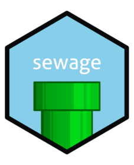
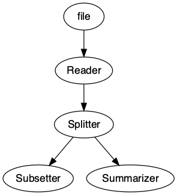
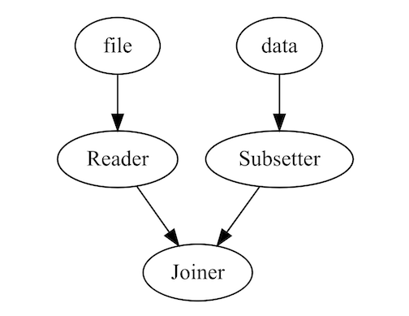

<!-- README.md is generated from README.Rmd. Please edit that file -->

```{r, include = FALSE}
knitr::opts_chunk$set(
  collapse = TRUE,
  comment = "#>",
  fig.path = "man/figures/README-",
  out.width = "100%"
)
```

# sewage <a href="https://mwhalen18.github.io/sewage/"></a>

<!-- badges: start -->
[](https://github.com/mwhalen18/sewage/actions/workflows/R-CMD-check.yaml)
[](https://lifecycle.r-lib.org/articles/stages.html#experimental)
<!-- badges: end -->

The goal of sewage is to provide a light-weight pipelining interface for data analyses. Rather than construct long scripts with intermiediate datasets or processes, you can construct a single pipeline and run it in a single call.

## Installation

You can install the development version of sewage from Github:

```{r, eval=FALSE}
devtools::install_github("mwhalen18/sewage")
```

## Example

Below is an example of how to construct a simple pipeline.

```{r example}
library(sewage)
```

You can use any function as a component in the pipeline, including custom functions you define or import from an external source. 

```{r}
subset_data = function(x) {
  subset(x, cyl == 6)
}
summarizer = function(x) {
  return(summary(x[['disp']]))
}
```

Currently, there are 3 components ready for use: `Nodes`, `Splitters`, and `Joiners`. Nodes take one object as input and return exactly one object. Splitters take in exactly one object and may return any number of outputs greater than 1. `Joiners` take in multiple objects and return 1 object according to the method you pass to the `Joiner` (More on these components below).

```{r}
pipeline = Pipeline()
pipeline = pipeline |>
  add_node(component = readr::read_csv, name = "Reader", input = "file", show_col_types = FALSE) |>
  add_node(component = Splitter(), name = "Splitter", input = "Reader") |>
  add_node(component = subset_data, name = "Subsetter", input = "Splitter.output_2") |>
  add_node(component = summarizer, name = "Summarizer", input = "Splitter.output_1")
```

```{r}
pipeline
```

Note outputs of a Splitter are accessible by specifying the name of the splitter component (In this case `Splitter`) suffixed with the outgoing edge in the format `{name}.output_{i}`.

The first node in your pipeline should specify the argument that will be passed into the pipeline when we execute it (More on this below).

We can easily visualize our pipeline using the `draw` method.

```{r, eval=FALSE}
draw(pipeline)
```



Here we execute the pipeline with the `run` command. It is important to note that the argument you pass to `run` should match the `input` argument of your first node in your pipeline. In this case we are passing a `file` argument in `run` and similarly our first node is set to receive a `file` argument as input.

You may choose any argument name you like, as long as these two arguments match!

```{r}
result = run(pipeline, file = 'temp.csv')
print(result)
```


We can now access the results of our terminating nodes. A terminating node is any node that is not specified as input. By default when the pipeline is run, each node will overwrite the output of its input node. Therefore any node that is not fed forward to a new node will return output. In the case of this pipeline, the `Subsetter` and `Summarizer` edges are our terminating nodes. Therefore, we can access their results in the `outputs` object of the pipeline

```{r}
pull_output(result, "Subsetter")
```

```{r}
pull_output(result, "Summarizer")
```

## Multiple Entrypoints

It is also possible to pass in multiple entrypoints by specifying the inputs in your arguments. This allows you to process multiple documents and bring them together using a `Joiner` later in your pipeline. 

The `Joiner` will take multiple inputs and convert them to a single output in the pipeline according to the function specified. This component works nicely for `dplyr`-like joins, but is not restricted to these methods. 

```{r, message=FALSE, warning=FALSE, eval=FALSE}
library(dplyr)
pipeline = Pipeline()
pipeline = pipeline |>
  add_node(read.csv, name = "Reader", input = "file") |>
  add_node(subset_data, name = "Subsetter", input = "data") |>
  add_node(Joiner(method = dplyr::bind_rows), name = "Joiner", input = c("Reader", "Subsetter"))
output = run(pipeline, file = "temp.csv", data = mtcars)
```

```{r, eval=FALSE}
draw(pipeline)
```

{width=50%}

Using these three components (`Nodes`, `Splitters` and `Joiners`) you can construct complex data pipelines and run them in a single call. 


# Why sewage?

What is the point of `{sewage}` over more robust orchestrations tools like `{targets}` or Airflow? First, `sewage` is not an orchestration tool. Its primary purpose is to help modularize and organize complex data analysis scripts. If you have ever opened a single script to find multiple functions, intermediate datasets, visualizations, tests, models, and outputs, then sewage may be a starting place to aid in organization.

If you feel comfortable using packages like `{targets}` or Airflow you probably should.

